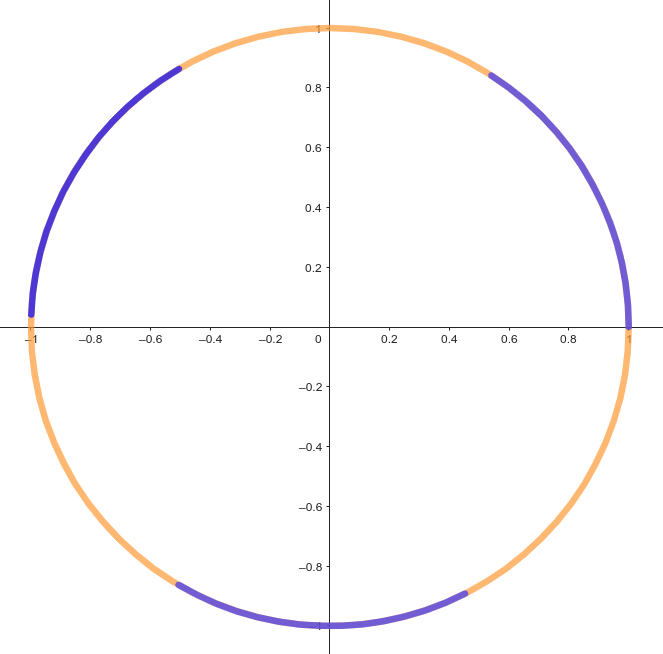

You have gotten yourself a gerbil and a nice large cage for it. You have even bought a lot of different toys for it to play with: a ball, a set of dominoes, and even a real Klein bottle! And still, to your great dismay, your gerbil seems to be upset with its new home! You ponder for a long time how you could make your gerbil happy. What could you still get your gerbil‽ And then it strikes you: The gerbil needs a wheel to run in! And no ordinary gerbil wheel suffices; you decide to order one with a custom paint job!

You know that the radius of the wheel needs to be exactly $r$ units of length, and that the coloring must satisfy strict requirements. For simplicity, you model the wheel as a circle where each circular arc has a specific color. The coloring of the circle needs to satisfy the following requirements:

- The wheel needs to be fully painted with *blue* and *orange* colors. The blue color calms the gerbil down while the orange color encourages the gerbil to move faster!
- When the gerbil is standing on an *orange* point of the wheel, there must be a *blue* point at distance exactly $1$ in either direction. Otherwise the gerbil might get too stressed.
- When the gerbil is standing on a *blue* point of the wheel, there must be an *orange* point at distance exactly $1$ in both directions. Otherwise the gerbil might get bored.

To refer to the points of the wheel, you use the following convention: You mark one of the points of the wheel as the origin. You then refer to each point by their distance from the origin along the wheel in counter-clockwise orientation. Hence every point is assigned a real number between $[0, 2\pi r]$.

All distances, apart from the radius, are measured along the arc of the wheel.

# Input

Input consists of one integer $r$, the radius of the gerbil wheel.

# Output

Output a list of arc segments of the wheel that need to be colored *blue*. The rest of the wheel is colored *orange*.

Each line of the output consists of two rational numbers, $x$ and $y$, describing a half-open interval $[x, y)$ of points on the wheel that are colored *blue*. They must satisfy $0 \le x < y \le 2\pi r$. Each rational number $\frac{p}{q}$ must be written in form `p/q`, where $1 \le q \le 10^6$.

The output may consist of at most $10^5$ segments.

# Constraints

- $1 \le r \le 1000$

# Example

Input:
```
1
```

Output:
```
0/1 2/2
21/10 31/10
46/11 57/11
```

The example is illustrated below.

