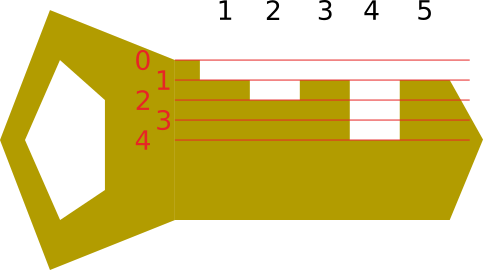

You forgot your key inside your house and are now locked outside. Fortunately, you remember precisely what your key looks like and have key cutting tools for producing a new one. A key can be described as a sequence of $n$ integers describing the depth at which each segment is cut. To construct a new key, you start with a key blank without any cuts. In other words, each segment has depth $0$ initially. Then, on a single operation you choose an interval of segments and remove metal within that interval from the key blank until reaching some chosen depth. What is the minimum number of operations you need to perform?

# Input

The first line of the input has the number of segments $n$.

The second line of the input has $n$ nonnegative integers describing the desired depths of each segment.

# Output

Output a single integer, the minimum number of operations needed.

# Constraints

- $1 \le n \le 10^5$
- Each depth is at most $10^9$.

# Example

Input:
```
5
1 2 1 4 1
```

Output:
```
3
```

Explanation: you can do the following operations:

- choose interval $[1,5]$, cut to depth $1$
- choose interval $[2,2]$, cut to depth $2$
- choose interval $[4,4]$, cut to depth $4$


